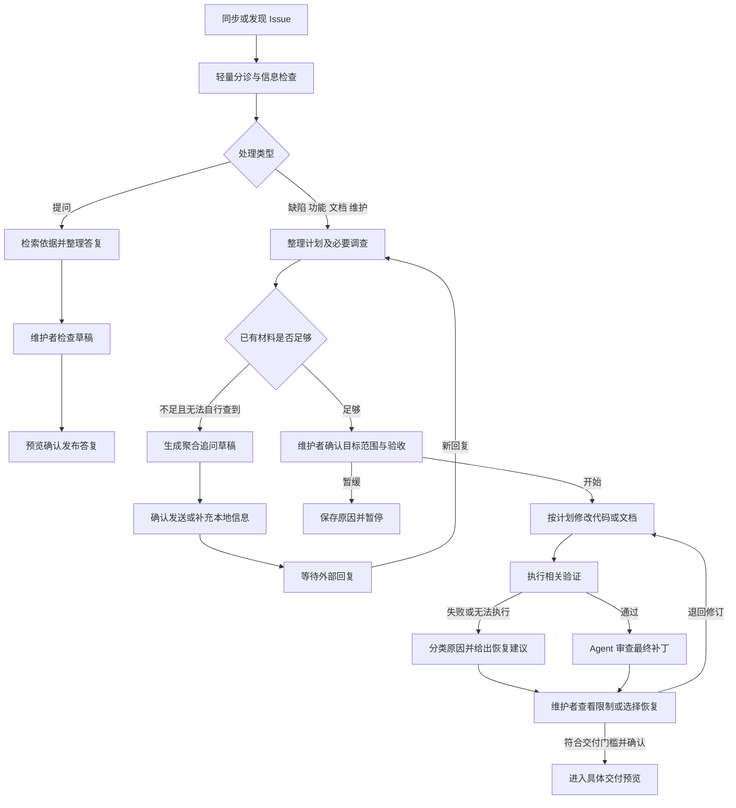
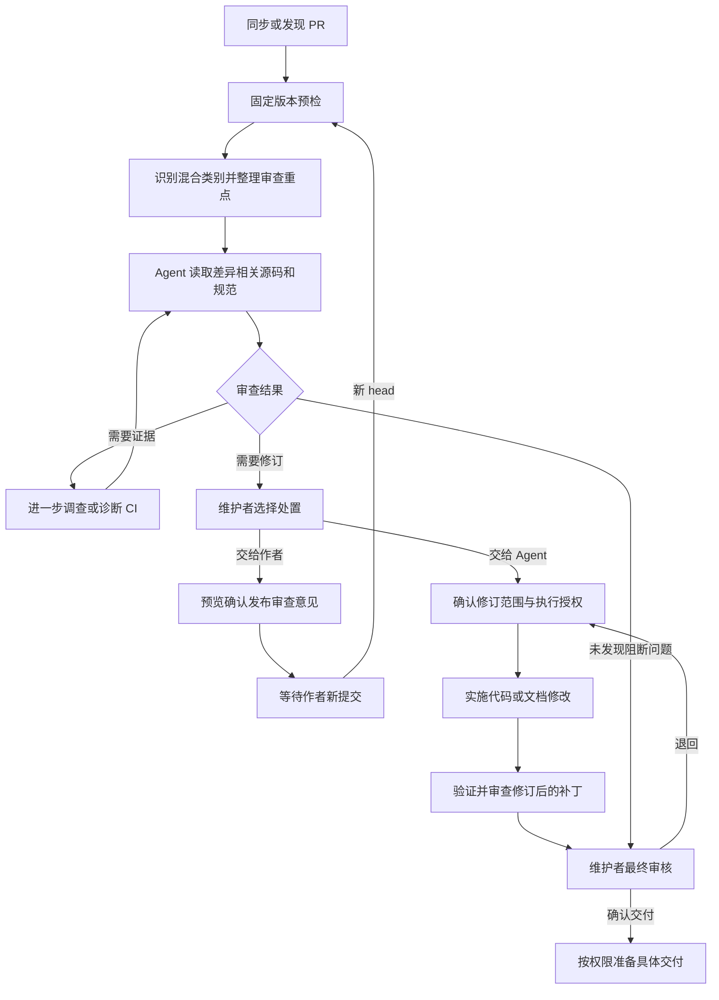

# 维护工作台工作流编排计划

日期：2026-10-09。状态：后续改造的设计与验收基线，尚未实现。

本计划面向开源仓库维护者，将系统已有的分诊、调查、实施、验证、审查和交付功能编排为持续推进的维护事项。系统先从现有材料整理处理建议与计划，维护者确认或修订；获准后连续执行，遇到真正的信息缺口、阻塞或需要取舍的变化时暂停。界面围绕计划确认、异常处理和最终审核组织。

## 1 范围与阶段边界

基于维护者提供的《工作流初步》及其流程图，采用以下调整：调查前及调查中检查信息完整度；按失败原因选择恢复路线；无法验证时明确限制与交付门槛；PR 按混合变更类型组合审查重点；交付区分新建 PR、更新已有 PR 与提供补丁；交给作者后等待新提交并复核新版本。

本期自动衔接获准计划中的正常阶段，**暂不实施 Agent 根据审查发现自动修改、验证和复核的循环**。审查发现需要修订时交给维护者选择；最终审核退回后，依据明确反馈派发新的修订，保留来源关系。以后单独扩展有界自动修订。

本期不新增自动合并、自动关闭 Issue、无确认公开回复或无确认代码推送。现有发布预览、宿主审批、版本校验和证据门槛继续生效。新计划不覆盖原有任务、补丁和执行历史。

## 2 人与系统的分工

| 工作 | 系统责任 | 维护者参与 |
|---|---|---|
| 资料整理 | 读取事项描述、相关讨论、关联工作、仓库规范与已有有效产物，注明来源和覆盖缺口 | 修正系统理解 |
| 路线与计划 | 推荐处理路线，生成目标、范围、排除项、验收条件和检查方式 | 确认、修改或暂缓 |
| 连续执行 | 按已确认计划准备工作区、实施、验证和审查，自动交接有效证据 | 处理宿主审批及必要异常 |
| 缺失信息 | 先检索现有资料，再聚合真正缺失的问题，准备追问草稿 | 确认对外发送或补充本地信息 |
| 审查问题 | 展示有依据的发现、影响和建议，保留历史处置 | 选择交给作者、交给 Agent、继续调查或不采纳 |
| 最终审核 | 汇总目标完成情况、验证证据、未解决发现、修订记录及交付操作 | 接受、退回或继续调查 |
| 交付跟踪 | 准备具体发布预览，核对远端回执，跟踪 PR 新提交、CI、审查和合并状态 | 确认具体交付动作 |

计划确认覆盖计划内的本地执行，不自动授予远端写入许可，也不替代宿主权限。低成本资料整理可以沿用仓库策略自动触发；深度执行需事项授权或明确的仓库规则。

## 3 计划草稿及确认

### 3.1 草稿内容

系统从 Issue 或 PR 标题、正文、必要讨论、关联事项、适用仓库规范及当前有效调查结果中整理：

- 事项类型与建议路线。
- 维护目标、修改范围和排除项。
- 验收条件及对应检查方式；尚不能判定的内容注明待确认。
- Bug 的复现条件、预期和实际行为；只有相关类型才显示这些字段。
- PR 的变更意图、关联目标、混合变更类别和审查重点。
- 需要补充的信息、影响的判断，以及是否阻塞下一步。
- 每项内容的来源引用，明确区分原始要求、调查事实和系统建议。

仓库命令发现只提供检查候选，不表示已执行。资料有截断或不可访问时保留覆盖提示。已有调查必须与当前版本和事项匹配，旧报告可以作背景，不能成为新版本已验证事实。

### 3.2 确认与更新

默认展示可阅读的草稿摘要；编辑表单在“修改建议”中展开。主要动作是“确认并开始”“修改建议”和“暂缓”。真正缺少必要信息时显示“补充信息”，只列需要回答的字段，避免重新填写已有内容。

确认后保存固定的计划版本、来源快照与执行授权。授权展示允许的步骤、修改范围、检查方式、时间及执行预算。系统自动推进范围内步骤；发现需要改变目标、范围或验收条件时生成差异，等待重新确认。草稿更新不能悄悄覆盖已确认计划。

暂缓记录原因，并停止后续自动派发。已有任务的取消使用明确操作，不能把暂缓误当作已回滚修改。

## 4 Issue 处理路线

### 4.1 类型短路径

| 类型 | 确认前的系统工作 | 获准后的默认路线 |
|---|---|---|
| Bug | 检查复现材料；必要时复现、调查原因；形成修复目标与检查计划 | 复现及实施 → 验证 → 补丁审查 → 最终审核 |
| Feature | 整理需求、兼容性取舍、范围及验收草稿；必要时调查实现约束 | 实施 → 验证 → 补丁审查 → 最终审核 |
| Docs | 核对描述、文档位置与适用规范，整理具体修改和检查条件 | 文档修改 → 文档验证 → 内容及范围审查 → 最终审核 |
| Question | 检索仓库和文档，形成有依据的答复；不足时聚合追问 | 检查答复 → 确认发布 → 记录本地处理结果 |
| Maintenance | 整理维护目标、影响与风险，必要时调查 | 按实际变更采用代码或文档路线 |

信息检查贯穿全过程。能从仓库、现有讨论和有效调查中获取的资料由系统补齐；只有无法自行获取且影响判断的信息才追问。清晰文档修改可以直接形成计划，不强制执行独立调查。小 Bug 可以在实施阶段内完成复现，不必再开同内容调查任务。

疑似重复保留依据；已有解决该事项的 PR 时转入关联 PR 跟踪或审查，避免重复创建变更。提问需要修改文档时形成关联改进事项，并单独确认变更目标。

### 4.2 追问及恢复

追问区分草稿、已发送、等待回复、新回复待评估和已结束。本地生成草稿不显示成已经发出；发布响应不确定时先核对回执。系统按已提出的问题合并和去重，避免重复追问。

收到回复后重新评估相关缺口和计划；必要时回到分诊，材料已经明确时直接恢复适用阶段。不重复跑完整流程，不自动把任意新评论视为信息已经充分。

## 5 PR 处理路线

### 5.1 预检与混合类别

预检获取当前 head/base、目标分支、草稿状态、差异范围、可见 CI、冲突、已有审查及关联目标。缺陷修复、功能、文档、重构、维护和 CI 可以同时存在；系统组合审查清单，不要求选唯一类别。

描述充分时从 PR 和关联 Issue 直接整理审查目标，无需维护者重新填写 Issue 实施表单。只读审查沿用已有委派或仓库策略；委派 Agent 修改需要确认具体修订范围。

### 5.2 审查及新版本复核

审查消费固定差异、相关源码和适用规范，展示逐条发现、依据与覆盖范围。无发现可以作为审查结果，不能自动代表必要检查通过或远端可合并。

需要证据时，在已授权的只读范围和预算内继续调查或诊断；资料不可访问、预算耗尽或反复没有新证据时停止并说明缺口。需要修改时交给维护者选择，本期不自动修复审查发现。

“交给作者”发布前展示具体评论或 Review 内容。发布确认后记录等待对象、对应发现及已审查 head。等待期间不重复启动同版本审查；发现新提交时使受影响证据过期，重新预检并复核原发现及新变更。CI 状态变化单独刷新，不因每次 CI 更新重新读完整差异。

复核保留历史发现 ID 和处置关系，并区分已解决、仍存在和无法验证；旧版本通过报告不能充当新版本验证。没有新提交时，维护者仍可手动刷新事实或改变处置。

## 6 验证失败及无法执行

| 结果或原因 | 系统处理 | 后续动作 |
|---|---|---|
| 必需检查通过且证据完整 | 保存同版本、同补丁的实际执行记录 | 自动进入补丁审查 |
| 代码行为错误 | 展示失败命令、复现和影响，建议对应代码修订 | 维护者选择修订后进入代码路线 |
| 文档内容、链接或格式错误 | 展示具体位置与检查失败，建议文档修订 | 维护者选择修订后进入文档路线 |
| 环境、依赖或权限阻塞 | 区分可在既有授权内恢复的条件与需要人工处理的条件 | 可恢复步骤有界执行；否则等待明确解除条件 |
| 执行证据缺失 | 使用现有证据补齐机制，仍无法补齐则标记未验证 | 补验证或等待维护者处理 |
| 未请求的检查没有执行 | 记录覆盖限制 | 不自动扩大任务范围或阻塞已满足的验收 |

本期验证失败不触发无限修改循环。修订由维护者明确选择；一旦确认本次修订，系统继续衔接实施、验证和审查。审查问题同样由维护者决定是否修订。

“无法执行”仍可进入最终审核，便于查看成果及限制，但不得显示为通过。必要验收缺失时不能正常接受并发布为已通过成果；继续调查、处理环境或导出未验证补丁等动作需明确标记当前限制，并遵守现有交付门槛。

环境检查提前识别计划所需命令、依赖及权限。允许的初始化仅在隔离工作区内执行并记录；不能为推进流程自行提高宿主权限，也不能把未授权整仓库测试追加成当前任务的必需验收。

## 7 最终审核与具体交付

### 7.1 最终审核

复用现有五部分概览及快捷定位：

1. 目标完成情况：已确认目标、修改范围、逐项验收条件及实际完成内容。
2. 验证证据：当前版本和补丁的检查、实际执行记录、未执行检查与原因。
3. 未解决发现：当前及历史仍有效的问题，明确处置和覆盖限制。
4. 修订记录：来源任务、反馈、修订补丁与复核结果。
5. 交付操作：接受、退回、继续调查、具体发布预览和交付记录。

验收条件与证据逐项关联，区分有证据支持、未验证及需人工判断。接受某份报告、接受本地成果、确认远端动作仍有各自含义；界面不要求机械接受每份中间报告。

### 7.2 交付方式

| 场景 | 交付方式 | 必须保留的关系及检查 |
|---|---|---|
| Issue 产生新变更，尚无对应 PR | 创建草稿 PR | 关联源 Issue、已审核补丁、目标分支与远端回执 |
| 修订已有 PR 且有原分支写权限 | 更新已有 PR 分支 | 保持原 PR 关联；核对当前 head/base，不强推覆盖他人提交 |
| 无原分支写权限或不允许推送 | 提供补丁及说明 | 标明基线、补丁版本、验证限制和使用方式；不伪装成已更新原 PR |
| 只需答复或交给作者处理 | 发布回复或审查意见 | 确认具体内容、目标对象、版本与发布回执 |
| 本地事项无可用远端 | 按现有能力本地应用或导出 | 不创建合成 GitHub Issue 或 PR |

权限未知时明确显示待核对，不把未知当作无权限或可写。若原分支无法写入，提供补丁作为默认恢复出口；向其他分支新建贡献 PR 属于另一项具体交付选择，需重新展示目标及预览。

发布后跟踪对应 PR 的新提交、CI、审查和合并事实。PR 创建、补丁推送、审查意见发布、PR 合并和 Issue 关闭分别记录；发布意见不等于完成作者修订，PR 合并也不自动证明源 Issue 已关闭。未知或未确认回执先核对，避免重复发布。

## 8 界面与事项进度

### 8.1 主要界面

| 位置 | 默认呈现 | 主要动作 |
|---|---|---|
| 未处理事项 | 当前材料及系统处理建议 | 开始处理或查看处理建议 |
| 计划确认 | 草稿、来源、缺口、执行范围与预算 | 确认并开始、修改建议、暂缓 |
| 执行中事项 | 当前系统动作、已完成步骤、下一步、暂停原因 | 查看记录、暂停或取消；可选补充说明 |
| 异常决定 | 具体问题、影响、解除条件与推荐恢复路线 | 补充信息、解除阻塞、选择修订或继续调查 |
| 最终审核 | 五部分概览及当前交付资格 | 接受、退回、继续调查、打开交付预览 |
| 等待外部事项 | 等待谁、等待什么、上次检查时间 | 查看追问或审查意见、刷新或调整处置 |

主区域只显示当前推荐动作及原因。原有分诊、调查、文档维护、实施、验证和审查能力集中在一个默认收起的“高级操作”入口中，保留单独运行、调整路线、补充说明和查看完整记录；所有高级操作继续经过后端门槛检查。

“下一阶段目标与验收”不再要求每阶段填写。已确认计划及来源证据自动交接，维护者说明作为可选修订；改变约定范围时重新确认。

### 8.2 首页与执行列表

“需要我处理”按事项聚合为待确认计划、需要补充或解除阻塞、待最终审核。只有存在维护者可采取的动作才进入该队列；系统执行中和单纯等待外部回复分别归入执行区及等待区。点击待办直接打开对应事项的决策位置。

执行列表以事项为单位展示进度，在事项内展开分诊、调查、实施、验证、审查及重试记录。数量区分事项数与运行次数，保留所有历史，不因重试增加相同事项的待办计数。

事项进度、当前执行状态、产物有效性和远端事实分别展示。不能用一个“完成”标签同时代表 Agent 结束、必要验证通过和 PR 合并。

### 8.3 批量处理

批量主入口为“分析所选事项”，按 Issue 或 PR 自动选择材料整理和预检路线，生成逐项计划或审查建议。维护者查看逐项目标、缺口、预算及是否已有进行中任务，再选择“按建议开始处理”。

混合类型、已暂缓、等待回复、有进行中任务和输入过期的事项分别处理；不把同一种 JobKind 强加给全部选择。已具备有效建议的事项复用结果，无需为批量入口重复分析。逐项记录新建、复用、等待、跳过和失败，不用整体成功掩盖部分失败。

## 9 通用编排状态与恢复

### 9.1 后端统一推进

后端统一响应同步、计划确认、任务完成、新回复、新 PR 提交、失败、暂停、取消和发布回执事件，计算下一步及其理由。前端消费后端给出的推荐动作、等待原因和交付资格，不在多个组件中各维护一套阶段选择规则。

复用现有 JobKind、阶段产物、工作区、队列、来源交接、验证与发布检查。新增事项级编排记录关联这些对象，不创建第二套执行器。

记录至少包含事项身份、当前输入版本、草稿与已确认计划版本、授权范围、当前步骤、来源任务、检查点、预算、等待对象、阻塞原因和恢复条件。技术字段可以增加，用户界面只显示能帮助理解和决定的内容。

### 9.2 恢复规则

- 重复事件：同事项、同计划、同输入、同来源的步骤去重，不重复派发；同事项写入继续串行。
- 重启：从持久化记录核对任务状态、工作区、HEAD 和补丁；不能确定执行结果的步骤暂停核对，不静默重放修改。
- 取消：停止继续派发；保留产物及已发生的远端记录。取消本地执行不表示撤销 GitHub 动作。
- 版本变化：使依赖旧输入或旧补丁的证据失效；重新评估受影响步骤，保留不受影响的材料，必要时重新确认计划。
- 格式失败：复用现有无工具整理与版本检查，不因报告格式问题重复修改代码。
- 环境或权限问题：先核对实际条件，再选择恢复；不依靠重复启动模型解决同一阻塞。
- 循环与预算：调查、证据补齐和复核都有限次及预算；没有新证据或达到上限时返回具体人工决定。
- 远端写入结果不明：先核对精确对象与回执，不立即重发。内容或目标改变后重新形成发布预览。

仓库自动策略在事项级闭环验证后扩展。默认继承已有模型和权限，按仓库明确允许自动整理、只读调查或审查、已授权计划推进等范围；对代码写入、预算和停止条件保持可见，不以笼统自动开关授予所有动作。

## 10 实施顺序及功能复用

| 阶段 | 本阶段交付 | 优先复用的位置 |
|---|---|---|
| A 编排基础 | 统一后端下一步规则、事项编排记录、授权与恢复；保留旧任务可读 | `src/core/workbench.ts`、`issue-flow.ts`、`store.ts`、`types.ts`、`revision.ts` |
| B 文档闭环及详情 | 草稿生成及来源、确认后自动修改验证审查、一个主动作及高级操作 | `repository-context.ts`、阶段产物与 native runner、`IssuePlanning.tsx`、`WorkflowPanel.tsx`、`ReviewSummary.tsx` |
| C Issue 与 PR 路线 | 类型短路径、缺口与追问、失败分流、混合 PR 审查、等待作者新提交及复核 | 现有分诊与预检、informationRequests、CI、finding followup、PR 版本及交接逻辑 |
| D 首页批量及策略 | 事项聚合、决策队列、逐项批量建议与派发、仓库级策略 | `App.tsx`、`Attention.tsx`、现有任务追踪、队列、公平调度及仓库策略 |

A 与 B 作为第一批可用改造共同交付，以此前第二轮文档事项验收。C 与 D 在正常闭环和失败恢复稳定后扩展。本期不把自动修复审查发现加入任一阶段。

历史工作流设计、实现记录和验证记录保留原日期与事实；本计划作为这次后续改造的路线及界面基线，不把设计目标写成已实现功能。

## 11 验收清单

| 场景 | 必须达到的行为 |
|---|---|
| 第二轮文档事项 Issue #3 | 使用事项描述及仓库规范生成具体目标、范围、验收草稿；材料充分时不要求重复填写；一次确认后连续完成文档修改、验证及必要审查，进入五部分最终审核 |
| 文档失败 | 链接或内容失败推荐文档修订；环境或证据问题进入对应恢复，不能统一转代码修复 |
| 缺信息 Issue | 系统先检索，聚合真实缺口；确认发送后进入等待；新回复更新受影响计划，不重复追问或无条件重跑 |
| 清晰 Bug 与功能 | 路线符合类型，复用已有调查；只有范围或取舍发生变化才重新确认 |
| 混合 PR | 能组合代码、文档和 CI 审查重点，并绑定同一 head/base |
| 交给作者 | 发布确认后等待新提交；相同 head 不重复审查；新 head 复核历史发现并显示新版本证据 |
| PR 修改权限 | 有权限时更新原 PR，无权限时提供标明基线的补丁；未知权限明确显示待核对；不重复创建已有 PR |
| 无法验证 | 最终审核可见限制和解除条件，不能把必需验收缺失显示为通过或绕过正常交付门槛 |
| 重复事件及重启 | 不重复派发已确定步骤；不静默重放状态不明的代码修改；工作区和历史保持可检查 |
| 取消及版本变化 | 取消停止后续步骤；新计划或新提交使相关旧证据失效，旧通过报告不能覆盖当前状态 |
| 首页与批量 | 待办按事项与真实决策点聚合；混合选择逐项给出路线、复用及失败结果；等待外部和系统运行不挤入人工决策队列 |
| 本期边界 | 审查发现不自动触发修改；维护者选择修订后才执行新的实施验证审查；不自动合并或关闭事项 |

在相同案例上记录需要填写的字段、阶段派发次数、主要决策次数、重复读取及追问次数、执行预算和证据完整性。文档正常路径以“确认计划、最终审核、确认交付”为主要人工决策目标，宿主审批和真实异常另行统计。自动化测试与脚本回放验证工程行为，真实案例验证操作负担，不将确定性夹具当作真实模型质量结论。

## 12 后续扩展

自动修复审查发现后续单独设计：限定在已确认范围，设置修订上限，逐轮保存失败、补丁、验证及复核；范围变化、意见冲突和超出预算时交给维护者。本期保留所需的计划、授权、来源关系及历史记录，为后续扩展提供基础。
